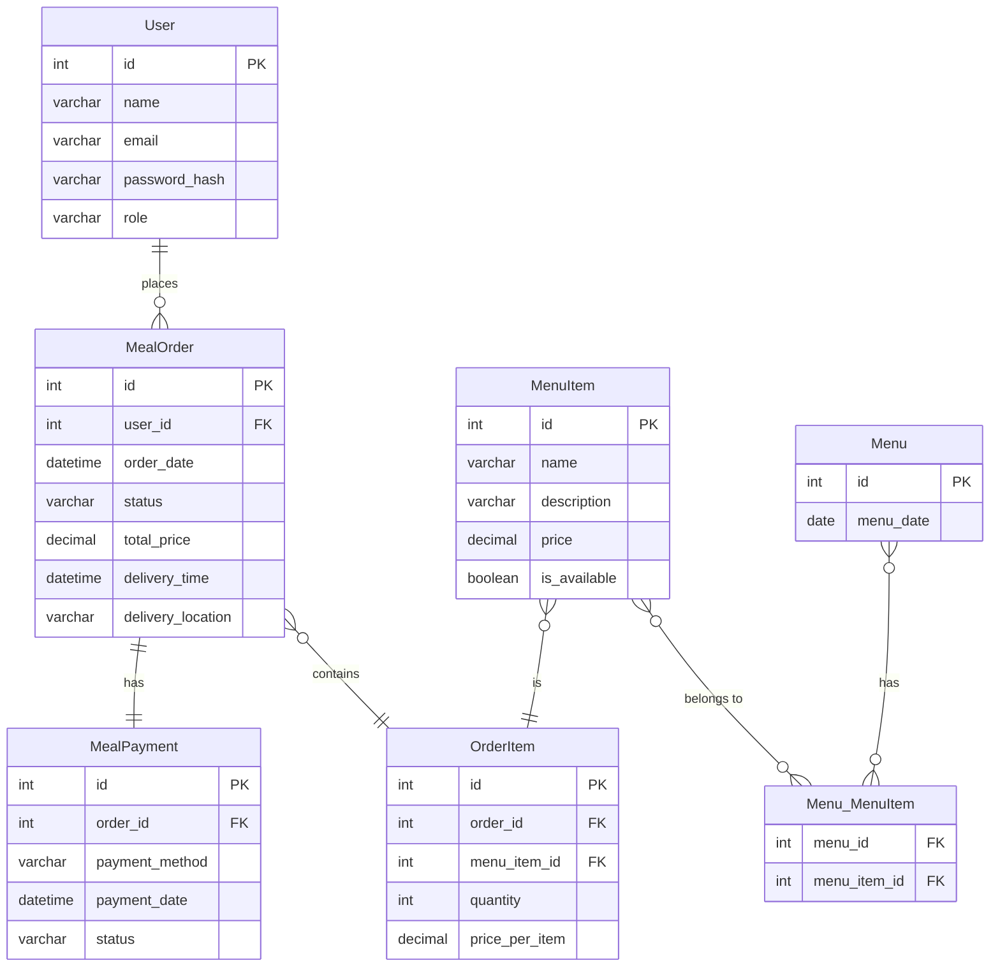
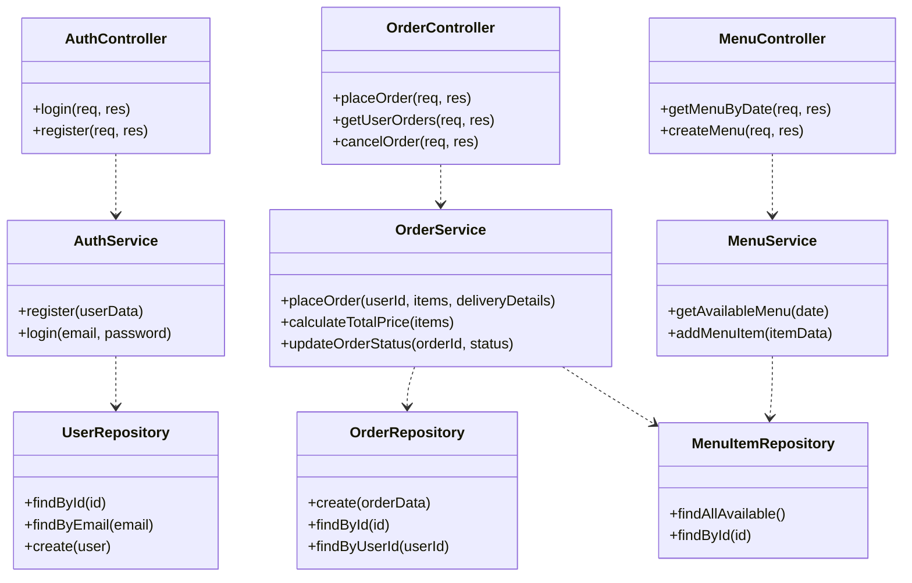
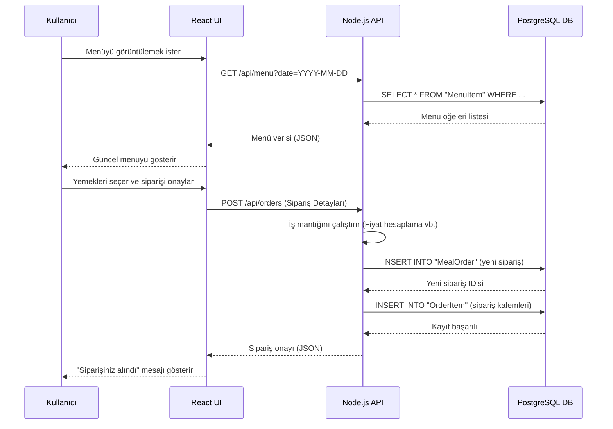
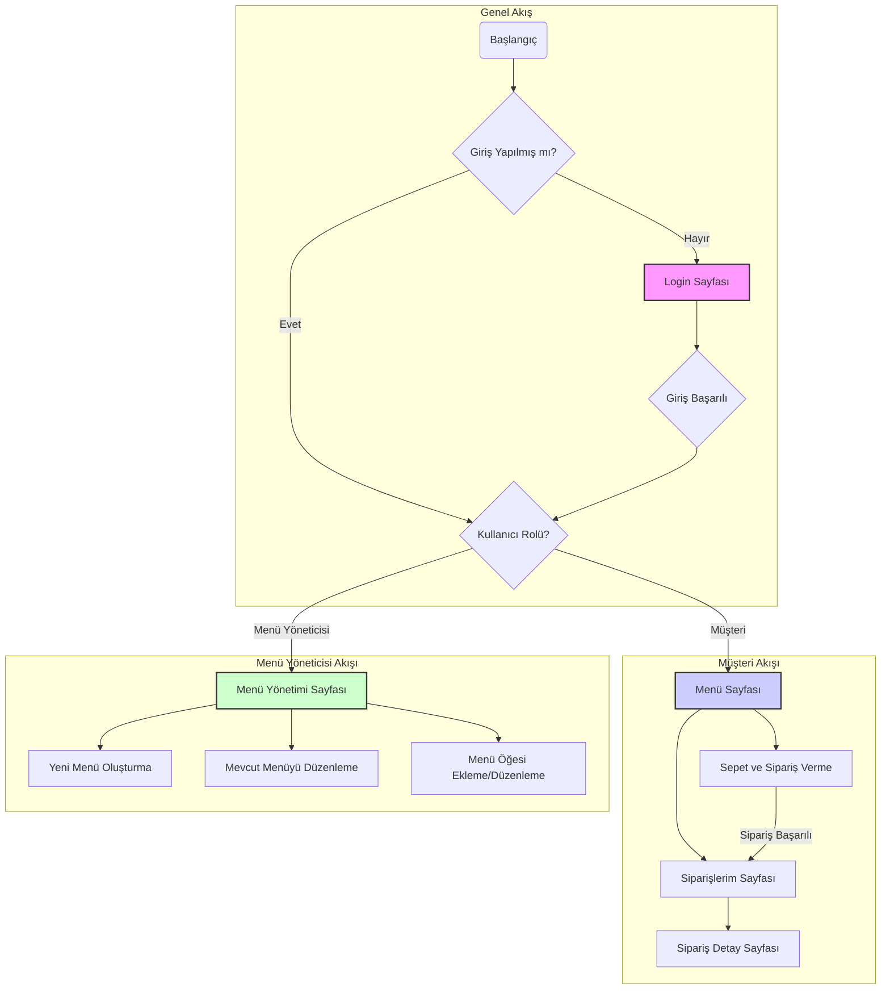

# Kafeterya Sipariş Sistemi - Tasarım Dökümanı

## 1. Giriş

Bu döküman, "Kafeterya Sipariş Sistemi" (Cafeteria Ordering System - COS) için yazılım tasarımını detaylandırmaktadır. Döküman, **`2025-11-13-BIDB-CafeteriaOrdering-RequirementsDefinition-V04.md`** numaralı gereksinim analiz raporuna dayanarak hazırlanmıştır. Amacı, geliştirme ekibine yol gösterecek teknik mimariyi, API tasarımını, veri modelini ve temel uygulama bileşenlerini tanımlamaktır.

## 2. Mimari Yaklaşım

Sistem, modern web teknolojileri kullanılarak **Client-Server (İstemci-Sunucu)** mimarisine uygun olarak geliştirilecektir. Bu mimari, sorumlulukların net bir şekilde ayrılmasını sağlayarak esneklik ve ölçeklenebilirlik sunar.

- **Frontend (İstemci):** Kullanıcı arayüzü, **React** kütüphanesi kullanılarak geliştirilecektir. Bu, dinamik ve etkileşimli bir kullanıcı deneyimi sağlar. Bileşen tabanlı yapı, kodun yeniden kullanılabilirliğini artırır.
- **Backend (Sunucu):** Sunucu tarafı iş mantığı, **Node.js** ve **Express.js** framework'ü ile geliştirilecektir. Bu platform, asenkron yapısı sayesinde yüksek performanslı I/O işlemleri sunar. API, RESTful prensiplerine uygun olarak tasarlanacaktır.
- **Veritabanı:** Veri kalıcılığı için ilişkisel bir veritabanı olan **PostgreSQL** tercih edilmiştir. PostgreSQL, veri bütünlüğü, güvenilirlik ve geniş özellik seti ile bu proje için uygun bir seçimdir.
- **Katmanlı Mimari (Backend):** Sunucu uygulaması, sorumlulukları ayırmak için katmanlı bir yapıya sahip olacaktır:
    - **Controllers (Kontrolcüler):** HTTP isteklerini karşılar, verileri doğrular ve ilgili servislere yönlendirir.
    - **Services (Servisler):** Ana iş mantığını içerir. Gerekli hesaplamaları, validasyonları ve işlemleri yürütür.
    - **Repositories (Depolar):** Veritabanı sorgularını yönetir ve veri erişim mantığını soyutlar.
    - **Models (Modeller):** Veritabanı tablolarını temsil eden veri yapılarıdır (örn: Sequelize modelleri).

## 3. Veri Modeli Tasarımı (ER Diyagramı)

Veritabanı, sistemdeki temel varlıkları ve aralarındaki ilişkileri yansıtacak şekilde tasarlanmıştır. Gereksinim dökümanındaki mantıksal model burada fiziksel bir ER diyagramı olarak detaylandırılmıştır.

**Açıklamalar:**
- **User:** Sisteme kayıtlı kullanıcıları (Müşteri, Menü Yöneticisi vb.) temsil eder. Rol tabanlı yetkilendirme için `role` alanı içerir.
- **MealOrder:** Bir kullanıcının verdiği tek bir siparişi temsil eder.
- **MealPayment:** Siparişe ait ödeme bilgilerini tutar. `MealOrder` ile bire-bir ilişkilidir.
- **MenuItem:** Menüde yer alan her bir yemek seçeneğidir.
- **OrderItem:** Bir siparişin içinde hangi `MenuItem`'dan kaç adet olduğunu belirtir. `MealOrder` ve `MenuItem` arasında bir "çok-a-çok" ilişki kurar.
- **Menu:** Belirli bir tarihte sunulan yemek listesini gruplamak için kullanılır.
- **Menu_MenuItem:** Hangi yemeğin hangi günün menüsünde olduğunu belirten bir ara tablodur.

## 4. API Uç Noktaları Tasarımı (RESTful API)

Backend sunucusu, frontend ile iletişim kurmak için aşağıdaki RESTful API uç noktalarını sunacaktır.

| Method | Endpoint | Açıklama | Yetki |
| :--- | :--- | :--- | :--- |
| `POST` | `/api/auth/register` | Yeni kullanıcı kaydı oluşturur. | Herkese Açık |
| `POST` | `/api/auth/login` | Kullanıcı girişi yapar ve token döner. | Herkese Açık |
| `GET` | `/api/menu` | Belirli bir tarihteki menüyü getirir. (`?date=...`) | Müşteri |
| `POST`| `/api/menu` | Yeni bir menü ve menü öğeleri oluşturur. | Menü Yöneticisi|
| `GET` | `/api/orders` | Kullanıcının geçmiş siparişlerini listeler. | Müşteri |
| `POST` | `/api/orders` | Yeni bir yemek siparişi oluşturur. | Müşteri |
| `GET` | `/api/orders/:id` | Belirli bir siparişin detayını getirir. | Müşteri |
| `PUT` | `/api/orders/:id` | Bir siparişi günceller (örn: iptal). | Müşteri / Admin |
| `GET` | `/api/delivery` | Teslim edilecek siparişleri listeler. | Yemek Dağıtımcısı|
| `PUT` | `/api/delivery/:id/status`| Bir siparişin teslimat durumunu günceller.| Yemek Dağıtımcısı|
| `GET` | `/api/reports` | Satış/sipariş raporlarını oluşturur. | Kafeterya Personeli|

## 5. Sınıf Diyagramı

Sunucu tarafı uygulaması, aşağıdaki temel sınıflar etrafında şekillenecektir. Bu diyagram, sorumlulukların katmanlı mimariye göre nasıl dağıtıldığını gösterir.

## 6. Kullanıcı Akış Diyagramı (Sekans Diyagramı)

Aşağıdaki diyagram, sistemin en temel kullanım senaryosu olan "Yemek Siparişi Verme" sürecini adımlar halinde göstermektedir.

## 7. Ekran Akış Diyagramı

Bu diyagram, sistemdeki temel kullanıcı rollerinin (Müşteri ve Menü Yöneticisi) uygulama içindeki ana gezinme yollarını göstermektedir.

